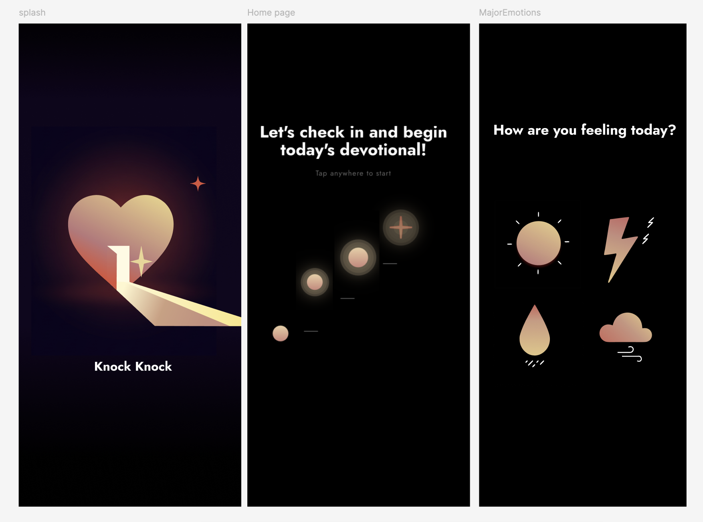

# Knock Knock

A mobile prayer companion that helps users build a daily habit of reflection through emotional check-ins, guided prayer, and faith-based conversation.

## About the project

Knock Knock is a mobile application designed to support young adults in building a consistent prayer habit in a gentle and approachable way. The product begins with emotional awareness, helping users name how they feel before guiding them into reflection, making prayer feel more personal, interactive, and accessible. It creates a structured experience that helps users flow into meaningful conversation and prayer.



### Screen Pages

- **Home Page**

- **Emotion Check-In Page**

- **Emotion Log / AI chat**

## Technologies Used

```
- React Native
- Expo
- TypeScript
- Supabase
- PostgreSQL
- AI API integration
- Figma
```
